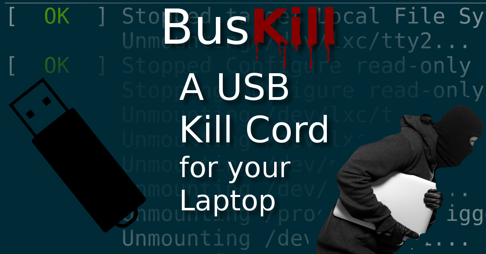

# buskill-linux
BusKill Kill Cord using udev on linux.

# Press

As seen on [PCMag](https://www.pcmag.com/news/372806/programmers-usb-cable-can-kill-laptop-if-machine-is-yanked), [Forbes](https://www.forbes.com/sites/daveywinder/2020/01/03/this-20-usb-cable-is-a-dead-mans-switch-for-your-linux-laptop/), [ZDNet](https://www.zdnet.com/article/new-usb-cable-kills-your-linux-laptop-if-stolen-in-a-public-place/), & [Tom's Hardware](https://www.tomshardware.com/news/the-buskill-usb-cable-secures-your-laptop-against-thieves).

# License

The contents of this repo are dual-licensed. All code is GPLv3 and all other content is CC-BY-SA.

# For more Information

See https://tech.michaelaltfield.net/2020/01/02/buskill-laptop-kill-cord-dead-man-switch/
